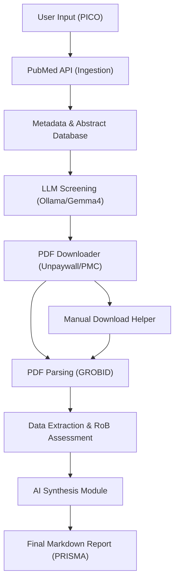

# Systematic Reviewer AI (SR-Gemma4)

[](https://github.com/HyunchanAn/Systematic_reviewer_AI)
[](https://github.com/HyunchanAn/Systematic_reviewer_AI)
[](https://github.com/HyunchanAn/Systematic_reviewer_AI)
[](https://github.com/HyunchanAn/Systematic_reviewer_AI)
[](https://github.com/HyunchanAn/Systematic_reviewer_AI)
[](https://github.com/HyunchanAn/Systematic_reviewer_AI/actions/workflows/python-ci.yml)

## Technical Architecture & Workflow

### Architecture Diagram


## 1. 개요

이 프로젝트는 체계적 문헌고찰(Systematic Review) 논문 작성 과정의 일부를 자동화하여 연구자의 부담을 경감시키는 AI 보조 파이프라인입니다. 로컬에서 구동되는 Ollama 기반의 Gemma 4 언어 모델을 핵심 엔진으로 사용하며, 문헌 검색, 스크리닝, 데이터 추출, 비뚤림 위험 평가(RoB), 보고서 생성 등의 모든 과정을 일원화하여 관리할 수 있습니다. 

최신 버전에서는 Streamlit 기반의 직관적인 웹 UI를 통해 누구나 코딩 지식 없이 연구 파이프라인을 구동하고 결과 데이터를 세밀하게 조정(Override)할 수 있는 Human-in-the-Loop 시스템을 갖추고 있습니다.

## 2. 주요 기능 및 구성 요소

-   **다중 모드 지원 (Execution Modes)**: 연구 목적에 따라 연구자가 직접 개입하며 데이터를 수정하는 `Human-in-the-Loop Mode`와, 대규모 문헌의 예비 타당성을 초고속으로 검토하는 `Full AI-driven Scoping Mode`를 분리하여 제공합니다.
-   **문헌 검색 및 수집 (Ingestion)**: PubMed API를 활용하여 PICO 질문에 기반한 검색 쿼리를 자동 생성하고 문헌 메타데이터를 수집합니다.
-   **자동 스크리닝 및 수동 검토 (Screening & Override)**: LLM을 활용하여 논문의 적합성을 판별합니다. AI의 판정 결과는 Streamlit 데이터 에디터를 통해 연구자가 즉시 확인하고 포함(Included)/제외(Excluded) 여부를 수동으로 변경(Override)할 수 있습니다.
-   **PDF 획득 관리 (PDF Download & Helper)**: Unpaywall 및 PubMed Central(PMC)을 통해 오픈 액세스 PDF를 자동으로 다운로드합니다. 다운로드에 실패한 논문은 수동 다운로드 도우미(Manual Helper)를 통해 손쉽게 시스템에 편입시킬 수 있습니다.
-   **PDF 구조화 파싱 (Parsing)**: GROBID를 이용해 PDF를 구조화된 TEI/XML 형식으로 변환하여 핵심 본문과 메타데이터를 추출합니다.
-   **비뚤림 위험 평가 (RoB Assessment)**: 전체 텍스트(Full Text)를 분석하여 5가지 주요 영역에 대한 비뚤림 위험을 모델이 자동 평가합니다.
-   **데이터 추출 (Extraction)**: PICO 프레임워크를 기반으로 연구 대상, 중재 방식, 대조군, 주요 결과 등을 추출 및 요약하여 정형화된 데이터프레임으로 제공합니다.
-   **AI 종합 결론 (Synthesis)**: 추출된 정보와 RoB 평가 결과를 바탕으로 연구 질문에 대한 종합적인 결론, 근거 신뢰도, 임상적 시사점을 종합 분석(Synthesis)하여 도출합니다.
-   **자동 보고서 생성 (Automated Reporting)**: 통계 데이터, PRISMA 다이어그램, AI 종합 결론, 자동 생성된 **참고문헌(References)** 리스트가 모두 포함된 완성형 마크다운(Markdown) 보고서를 생성 및 다운로드할 수 있습니다.

## 3. 프로젝트 구조

```text
.
├── data/             # 파이프라인 실행 중 생성되는 모든 데이터 및 최종 보고서 저장 폴더
├── models/           # 대규모 언어 모델 파일 저장 (Ollama 사용 시 불필요하나 구조 유지)
├── src/              # 파이프라인의 핵심 로직을 담고 있는 소스 코드 디렉터리
│   ├── ingest/       # PubMed 검색 및 PDF 획득 모듈
│   ├── parse/        # GROBID 파싱 및 텍스트 추출 모듈
│   ├── screen/       # LLM 기반 스크리닝 모듈
│   ├── rob/          # 비뚤림 위험(RoB) 평가 모듈
│   ├── llm/          # Ollama 클라이언트 및 종합 분석(Synthesizer) 모듈
│   ├── extract/      # 데이터(PICO 등) 추출 모듈
│   ├── report/       # 마크다운 보고서(References, PRISMA 포함) 생성 모듈
│   └── utils/        # SQLite DB 관리, 상태 업데이트 등 공통 유틸리티 모듈
├── tests/            # Pytest 기반의 유닛 테스트 코드
├── picos_config.yaml # PICO 연구 질문 설정 파일 (CLI 모드용 기본값)
├── app.py            # Streamlit 웹 애플리케이션 (주요 컨트롤러 역할)
├── main.py           # CLI 기반 메인 파이프라인 실행 스크립트
├── requirements.txt  # Python 라이브러리 의존성 목록
└── reference_materials/ # 개발 로그 및 참고 자료
```

## 4. Installation & Deployment

### 4.1 개발자 환경 구축 (Python)
1. **사전 요구사항**: Git, Python 3.11 이상, Docker Desktop (GROBID 구동용), Ollama.
2. Ollama 설치 후 모델 다운로드: `ollama pull gemma4`
3. GROBID 서비스 시작: 제공된 `scripts/start_services.bat` (관리자 권한) 실행
4. Python 의존성 패키지 설치 (`uv` 패키지 매니저 권장):
   ```bash
   uv pip install -r requirements.txt
   ```

### 4.2 비개발자용 간편 배포 (Docker Compose)
비개발자나 배포 전용 서버 환경의 경우, Docker Compose를 사용하여 애플리케이션 및 의존성 컨테이너들을 원클릭으로 구동할 수 있습니다.
1. 사전 요구사항: Docker 및 Docker Compose 설치
2. 백그라운드 구동:
   ```bash
   docker-compose up -d
   ```
3. (최초 1회) Ollama 컨테이너 내부에 모델 다운로드:
   ```bash
   docker exec -it sr_ollama ollama pull gemma4
   ```
4. 웹 브라우저에서 `http://localhost:8501` 접속.

## 5. Quick Start & Usage Example

가장 직관적이고 권장되는 환경은 Streamlit 기반의 웹 인터페이스를 활용하는 것입니다.

1. **앱 구동**
   터미널에서 앱을 실행합니다. (포트 충돌 방지를 위해 8502 포트를 권장)
   ```bash
   uv run streamlit run app.py --server.port 8502
   ```

2. **워크플로우 가이드 (Usage Example)**
   - **사이드바 설정**: `Human-in-the-Loop` 또는 `Scoping Mode`를 선택합니다.
   - **Step 1 (Search)**: 연구 주제나 PICO 요소(예: "노인 환자의 임플란트 만족도")를 입력하고 PubMed에서 메타데이터를 검색 및 적재합니다.
   - **Step 2 (Screening)**: 수집된 논문을 바탕으로 LLM 스크리닝을 진행합니다. 결과 테이블 에디터에서 AI의 판정 결과를 확인하고 필요 시 직접 `Included`/`Excluded`를 변경(Override)할 수 있습니다.
   - **Step 3 (Analysis)**: PDF를 다운로드 및 파싱한 후, RoB 평가와 데이터 추출을 진행합니다. Human-in-the-Loop 모드의 경우 추출된 데이터를 한 번 더 수동으로 점검 및 편집할 수 있습니다.
   - **Step 4 (Report)**: 최종 분석 결과를 종합하여 PRISMA 흐름도와 참고문헌이 자동 첨부된 마크다운 리포트를 생성합니다. (Scoping 모드 사용 시 시스템 자동 워터마크가 추가됩니다.)

## 6. 사용법 (CLI)

디버깅이나 대량 배치 처리를 위한 터미널 기반 실행 방식입니다.
```bash
python main.py
```
`picos_config.yaml`의 설정을 바탕으로 1단계부터 4단계까지의 파이프라인을 CLI 환경에서 연속으로 수행합니다.

## 7. 수동 PDF 추가 및 검증 (Manual Helper)

자동 다운로드(Open Access 등)에 실패한 논문이라도 직관적으로 시스템에 추가할 수 있습니다.
1. 앱의 **Manual Download Helper** 목록에서 확보하지 못한 논문(Failed)을 확인합니다.
2. 각 논문의 외부 링크 버튼(PubMed, DOI 등)을 통해 원문 PDF를 개별 확보합니다.
3. 파일명을 가이드에 따라 `{PMID}.pdf`로 변경하여 `data/pdf/` 폴더에 위치시키거나, 브라우저의 파일 업로드 위젯을 통해 바로 업로드합니다.
4. 파일이 업로드/감지되면 시스템에서 자동으로 상태를 업데이트하여 후속 분석(파싱, 데이터 추출) 대상에 포함시킵니다.
5. 도저히 구할 수 없는 문헌은 `[Skip]` 처리하여 통계 및 프로세스 병목을 해소할 수 있습니다.

## 8. 개발 로그

본 파이프라인의 기획, 문제 해결, 설계 결정 등 상세한 개발 여정은 프로젝트 루트 디렉터리의 `development_log.txt`에 기록되어 있습니다. 개발 철학이나 구조 변경의 맥락이 궁금하시다면 참고하시기 바랍니다.

## 9. Performance Benchmarks

### 9.1 테스트 및 권장 환경
- CPU: AMD Ryzen 9 9900X (12-Core, 24-Threads)
- GPU: NVIDIA GeForce RTX 5080 (16GB VRAM)
- RAM: 64GB DDR5-5600
- OS: Windows 11 (WSL2 지원)

### 9.2 시스템 한계점 (Limitations)
- **PubMed 의존성**: 현재 Ingestion 파이프라인은 주로 PubMed API에 의존합니다. Embase나 Cochrane 등 기타 데이터베이스 병합을 원할 경우 CSV 수동 임포트 기능 등 부가적인 징검다리가 필요합니다.
- **PDF 획득 한계**: 유료 구독이 필요한 Closed Access 논문이나 라이선스가 엄격한 논문은 시스템이 우회 획득을 보장하지 못합니다. (이 경우 Manual Helper 활용 권장)
- **RoB 완전 자동화의 맹점**: 비정형 텍스트에 대한 자동 비뚤림 평가는 정답률이 높으나 전문 역학 검토자의 판단과 미세한 차이가 발생할 수 있습니다. (반드시 Human-in-the-Loop 교차 검증을 권장)

## 10. 향후 과제 및 로드맵 (Roadmap)

### 10.1 기능 고도화
- **다중 DB 검색 엔진 통합**: PubMed 외에도 Embase, Cochrane Library, Scopus 등 다중 데이터베이스의 검색 결과를 API 수준에서 연동.
- **중복 제거(Deduplication) 고도화**: 다중 데이터베이스에서 수집된 문헌들의 중복 제거를 위한 Fuzzy Matching 기반의 스마트 병합 엔진 탑재.
- **다국어 논문 처리 확장**: 영문 외 제2외국어 및 한글 논문에 대한 KCI 연동 아키텍처 연구.

### 10.2 성능 및 신뢰성 강화
- **벤치마크 수행 (Gold Standard)**: 전문가 검토가 완료된 Gold Standard 체계적 문헌고찰 데이터셋을 바탕으로 AI 스크리닝 모듈의 민감도(Recall)와 특이도(Specificity) 정밀 측정 평가.
- **프롬프트 및 모델 최적화**: Gemma 최신 버전에 기반한 학술 논문 특화 프롬프트 엔지니어링 미세 조정.
- **RoB 2.0 및 ROBINS-I 세분화**: 무작위 임상시험뿐 아니라 관찰 연구 등 다양한 연구 디자인에 대한 비뚤림 평가 체계 고도화 적용.
