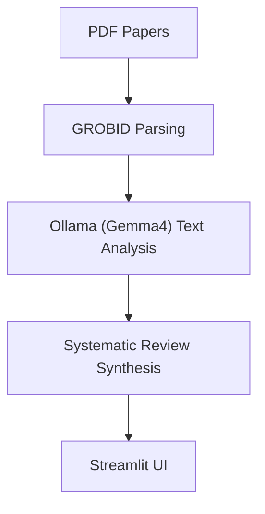

# Systematic Reviewer AI (SR-Gemma4)

[](https://github.com/HyunchanAn/Systematic_reviewer_AI)
[](https://github.com/HyunchanAn/Systematic_reviewer_AI)
[](https://github.com/HyunchanAn/Systematic_reviewer_AI)
[](https://github.com/HyunchanAn/Systematic_reviewer_AI)
[](https://github.com/HyunchanAn/Systematic_reviewer_AI)
[](https://github.com/HyunchanAn/Systematic_reviewer_AI/actions/workflows/python-ci.yml)

## Technical Architecture & Workflow

### Architecture Diagram


## 1. 개요

이 프로젝트는 체계적 문헌고찰(Systematic Review) 논문 작성 과정의 일부를 자동화하여 연구자의 부담을 경감시키는 AI 보조 파이프라인을 구축하는 것을 목표로 합니다. 로컬에서 구동되는 Ollama 기반의 Gemma 2 언어 모델을 기반으로, 문헌 검색, 스크리닝, 데이터 추출, 비뚤림 위험 평가, 보고서 생성 등의 작업을 효율화합니다.

최신 버전에서는 Streamlit 기반의 웹 UI를 제공하여 별도의 코드 수정 없이 직관적으로 파이프라인을 제어할 수 있습니다.

## 2. 주요 기능 및 구성 요소

-   문헌 검색 및 수집 (Ingestion): PubMed API를 활용하여 PICO 질문에 기반한 검색 쿼리를 자동 생성하고 문헌 메타데이터를 수집합니다. 미래 출판 예정 논문은 자동으로 필터링됩니다.
-   자동 스크리닝 (Automated Screening): LLM을 활용하여 수집된 논문의 제목과 초록을 분석하고, 사전에 정의된 PICO 기준에 따라 포함/제외 여부를 자동으로 판별합니다.
-   PDF 다운로드 (PDF Download): Unpaywall 및 PubMed Central(PMC)을 통해 오픈 액세스 PDF를 자동으로 다운로드합니다. **다운로드 실패 시 사용자가 직접 파일을 배치하고 검증할 수 있는 수동 다운로드 도우미(Manual Helper)가 제공됩니다.**
-   PDF 파싱 (Parsing): GROBID를 이용해 PDF를 구조화된 TEI/XML로 변환하여 본문을 추출합니다.
-   비뚤림 위험 평가 (RoB Assessment): LLM을 활용하여 전체 텍스트(Full Text)에서 5가지 영역(무작위 배정, 중재 이탈, 결측치, 결과 측정, 보고 비뚤림)에 대한 비뚤림 위험을 자동으로 평가합니다.
-   데이터 추출 (Extraction): PICO 프레임워크 기반의 핵심 정보를 추출하여 CSV로 저장합니다.
-   **AI 종합 결론 (Synthesis) [NEW]: 추출된 모든 데이터와 RoB 평가 결과를 바탕으로 AI가 연구 질문에 대한 종합적인 답변(결론, 근거 신뢰도, 임상적 시사점)을 작성합니다.**
-   자동 보고서 생성 (Automated Reporting): 분석된 통계와 추출 결과를 바탕으로 PRISMA 흐름도가 포함된 마크다운(Markdown) 보고서를 생성합니다. **AI가 도출한 종합 결론(Synthesis) 섹션이 포함됩니다.**
-   웹 인터페이스 (Web UI): Streamlit 기반의 대시보드를 통해 검색부터 보고서 생성까지의 전 과정을 시각적으로 관리할 수 있습니다.

## 3. 프로젝트 구조

```
.
├── data/             # 파이프라인 실행 중 생성되는 모든 데이터를 저장하는 폴더.
├── models/           # 대규모 언어 모델 파일 저장 (Ollama 사용 시 불필요하나 구조 유지).
├── src/              # 파이프라인의 핵심 로직을 담고 있는 소스 코드 디렉터리.
│   ├── ingest/       # PubMed 검색 및 PDF 다운로드 모듈.
│   ├── parse/        # GROBID 파싱 및 텍스트 추출 모듈.
│   ├── screen/       # LLM 기반 자동 스크리닝 모듈.
│   ├── rob/          # 비뚤림 위험(RoB) 평가 모듈.
│   ├── llm/          # Ollama 클라이언트 및 종합 분석(Synthesizer) 모듈.
│   ├── extract/      # 데이터 추출 모듈.
│   ├── report/       # 보고서 생성 모듈.
│   └── utils/        # 공통 유틸리티 함수.
├── picos_config.yaml # PICO 연구 질문 설정 파일.
├── app.py            # Streamlit 웹 애플리케이션 실행 파일.
├── main.py           # CLI 기반 메인 실행 스크립트.
├── requirements.txt  # Python 라이브러리 의존성 목록.
└── reference_materials/ # 개발 로그 및 참고 자료.
```

## 4. Installation

1. 사전 요구사항
   - Git
   - Python 3.9 이상
   - Docker Desktop (GROBID 실행용)
   - Ollama (LLM 실행용)

2. LLM 및 도구 준비
   - Ollama 설치 후 gemma4 모델 다운로드: `ollama pull gemma4`
   - Docker Desktop 실행 및 GROBID 서비스 시작 (제공된 `start_services.bat` 관리자 권한 실행 권장)

3. Python 의존성 설치
   ```bash
   pip install -r requirements.txt
   ```

## 5. Quick Start & Usage Example

가장 권장되는 실행 방식은 Streamlit 웹 인터페이스를 사용하는 것입니다.

1. **앱 실행**
   터미널에서 다음 명령어를 입력합니다. (포트 충돌 방지를 위해 8502 포트 사용 권장)
   ```bash
   python -m streamlit run app.py --server.port 8502
   ```

2. **웹 브라우저 접속**
   브라우저가 자동으로 열리거나, `http://localhost:8502`로 접속합니다.

3. **기본 워크플로우 (Usage Example)**
   - **Search 탭**: "노인 임플란트 환자의 만족도"와 같은 PICO 연구 질문을 입력하고 PubMed 검색을 실행합니다.
   - **Screening 탭**: 검색된 논문 리스트를 확인하고 AI 자동 스크리닝을 실행하여 적합한 논문을 분류합니다.
   - **Analysis Pipeline 탭**: 'PDF Download'를 통해 원문을 확보하고, GROBID 파싱 및 AI RoB 평가/데이터 추출을 순차적으로 수행합니다.
   - **Report 탭**: 추출된 데이터를 바탕으로 AI 종합 결론(Synthesis)을 도출하고 PRISMA 흐름도가 포함된 최종 보고서를 생성합니다.


## 6. 사용법 (CLI)

기존의 터미널 기반 실행 방식입니다.

```bash
python main.py
```
`picos_config.yaml` 설정을 기반으로 전체 파이프라인을 순차적으로 수행합니다.

## 7. 수동 PDF 추가 및 검증

자동 다운로드에 실패한 논문은 쉽게 수동으로 등록할 수 있습니다.
1. 앱의 **Manual Download Helper** 섹션에서 실패한 논문 목록 확인.
2. 각 논문의 [Link]를 통해 PDF 직접 다운로드.
3. 파일명을 가이드에 따라 `{PMID}.pdf`로 변경하여 `data/pdf/` 폴더에 저장.
4. 앱에서 **실시간 감지**를 통해 파일 상태가 자동으로 업데이트되거나, **[파일 확인]** 버튼 클릭 시 시스템이 파일을 확정하고 분석 대상으로 포함시킵니다.
5. 구하기 어려운 자료는 **[Skip]** 할 수 있습니다.

## 8. 개발 로그

프로젝트의 상세한 개발 과정은 루트 디렉터리의 [development_log.txt](development_log.txt) 및 [reference_materials/Development_log.txt](reference_materials/Development_log.txt)에 기록되어 있습니다.

## 9. Performance Benchmarks

### 9.1 테스트 환경
본 프로젝트는 아래 하드웨어 사양에서 최적화 및 검증되었습니다.
- CPU: AMD Ryzen 9 9900X (12-Core, 24-Threads)
- GPU: NVIDIA GeForce RTX 5080 (16GB VRAM)
- RAM: 64GB DDR5-5600
- OS: Windows 11 (WSL2 지원)

### 9.2 성능 평가 지표 (Performance Metrics)
1. **Pipeline Integrity**: 검색부터 보고서 생성까지의 데이터 흐름 및 파일 생성 여부 확인.
2. **PICO Extraction Accuracy**: LLM이 원문에서 PICO 요소를 정확하게 추출하는지 수동 검토와 비교.
3. **Screening Performance**: 연구 질문과의 적합성 판정 일관성.
4. **Parsing Quality**: GROBID를 통한 PDF 구조화(TEI-XML) 및 본문 추출 성공률.

### 9.3 벤치마크 결과 (최근 테스트)
- **테스트 일자**: 2026-02-15
- **테스트 데이터**: 노인 임플란트 만족도 관련 논문 34편
- **결과 요약**:
    - PubMed 검색 및 메타데이터 수집 성공률: 100%
    - PDF 확보율: 약 58% (자동 다운로드 + 수동 보조)
    - 데이터 추출 및 RoB 평가 완료율: 100% (확보된 PDF 기준)
    - 종합 보고서 생성 완료 및 PRISMA 렌더링 무결성 확인.

### 9.4 시스템 한계점 (Limitations)
- PubMed 의존성: 현재 검색 파이프라인은 주로 PubMed API에 의존하고 있어, 기타 데이터베이스(Embase 등)의 병합 검색은 수동 개입이 필요할 수 있습니다.
- PDF 자동 획득 한계: Open Access 논문이 아닌 경우 시스템이 PDF를 우회 다운로드할 수 없으며, Manual Download Helper를 통해 직접 폴더에 배치해야 하는 수고가 발생합니다.
- RoB 2.0 완전 준수: 일부 비정형 텍스트에 대한 자동 비뚤림 평가는 전문 검토자의 미세한 판단과 차이가 있을 수 있으므로 결과의 교차 검증을 권장합니다.

### 9.4 환경 검증 방법
아래 스크립트를 실행하여 로컬 환경의 준비 상태를 확인할 수 있습니다.
```bash
python tests/verify_pipeline.py
```

## 10. 향후 과제 및 로드맵 (Roadmap)

### 10.1 기능 고도화
- **DB 확장**: PubMed 외 Embase, Cochrane Library, Scopus 등 다중 데이터베이스 연동 및 자동 수집 기능.
- **중복 제거 엔진 정교화**: 여러 DB에서 수집된 논문의 중복 제거(Deduplication) 로직을 Fuzzy Matching 기반으로 고도화.
- **대화형 데이터 수정**: Streamlit UI 상에서 AI가 추출한 PICO 및 RoB 데이터를 연구자가 직접 수정하고 확정하는 인터랙티브 기능.

### 10.2 성능 및 신뢰성 강화
- **벤치마크 수행**: Gold Standard 데이터셋(전문가 검토 완료 문헌)을 활용하여 AI 스크리닝의 민감도(Recall) 및 특이도(Specificity) 정밀 측정.
- **모델 최적화**: Gemma 3 등 최신 로컬 모델 적용 및 학술 논문 특화 프롬프트 엔지니어링 고도화.
- **RoB 2.0 완전 대응**: 비뚤림 위험 평가 항목을 Cochrane RoB 2.0의 세부 알고리즘과 100% 일치하도록 로직 개선.

### 10.3 협업 및 배포
- **버전 관리 자동화**: 분석 세션별 데이터 아카이빙 및 재현성 확보를 위한 Git 기반 데이터 트래킹.
- **컨테이너화**: 전체 파이프라인(Ollama, GROBID, App)을 Docker Compose 하나로 통합 관리하는 패키징 작업.