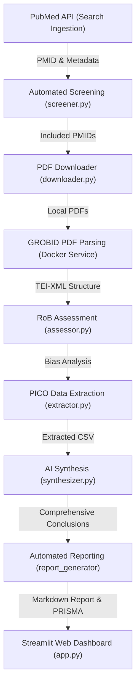

# Systematic Reviewer AI 아키텍처 설계 명세서 (ARCHITECTURE.md)

이 문서는 Systematic Reviewer AI 프로젝트의 전체 시스템 설계 사상, 모듈 간 협력 관계 및 엔드투엔드(End-to-End) 데이터 흐름을 상세하게 도식화하고 정리한 공식 아키텍처 명세서입니다.

## 1. 시스템 설계 개요

Systematic Reviewer AI는 연구자가 입력한 PICO(Population, Intervention, Comparison, Outcome) 질문을 바탕으로 메디컬/헬스케어 분야의 대량 논문을 수집, 분석, 스크리닝 및 종합 보고서 작성까지 보조하는 완전 로컬 구동형 파이프라인입니다.
로컬 환경의 데이터 보안을 지키면서 대규모 연산을 극대화하기 위해 로컬 LLM(Ollama) 및 도커 기반 PDF 구조화 서비스(GROBID)를 밀결합하여 구축되었습니다.

## 2. 데이터 흐름도 (Mermaid 아키텍처 다이어그램)

파이프라인의 핵심 데이터 흐름은 다음과 같습니다. 각 노드별 입력과 출력이 정의된 상태로 시각화됩니다.

## 3. 핵심 파이프라인 컴포넌트 기술 상세

- 1. Search Ingestion (PubMed 검색 및 수집)
  - 입력: picos_config.yaml 내에 정의된 PICO 메시
  - 처리: PubMed E-utilities API를 호출해 검색어 자동 합성 및 메타데이터(PMID, 저자, 초록, 발행 연도 등) 수집
  - 출력: data/raw/ 디렉토리 내 JSON 파일 적재

- 2. Automated Screening (자동 스크리닝)
  - 입력: 수집된 논문 초록 데이터 및 PICO 타겟 정의
  - 처리: src/screen/screener.py 모듈에서 Ollama Gemma 2 모델을 호출하여 PICO 부합도를 대조 및 자동 스크리닝 판정 (Include/Exclude/Unsure)
  - 출력: 스크리닝 판정 결과 데이터 적재

- 3. PDF Downloader (원문 다운로드)
  - 입력: 스크리닝 통과(Include) 논문의 PMID
  - 처리: Unpaywall API 및 PMC Open Access API 호출을 통한 자동 PDF 탐색 및 다운로드. 실패 시 수동 다운로드 도우미(Manual Helper) 제공
  - 출력: data/pdf/ 내 {PMID}.pdf 파일 저장

- 4. GROBID PDF Parsing (구조적 XML 파싱)
  - 입력: 로컬 PDF 문서
  - 처리: GROBID Docker 컨테이너 API(/api/processFulltextDocument)를 통해 PDF를 기계 인식 및 본문 문맥 파싱이 용이한 TEI-XML 구조로 가공
  - 출력: data/tei/ 내 TEI-XML 파일 저장

- 5. Risk of Bias Assessment (RoB 비뚤림 위험 평가)
  - 입력: 파싱된 TEI-XML 본문 데이터
  - 처리: Cochrane RoB 2.0 5대 도메인 가이드에 입각해 전체 텍스트에서 비뚤림 위험(High/Low/Some concerns) 자동 판정 및 근거 발췌
  - 출력: 비뚤림 평가 보고 데이터 생성

- 6. PICO Data Extraction (핵심 변수 추출)
  - 입력: TEI-XML 본문 텍스트
  - 처리: 연구 대상 인구수, 대조군 속성, 중재 기간, 최종 결과 지표 등 주요 수치형/텍스트형 연구 데이터를 LLM 기반으로 정밀 발췌
  - 출력: data/tables/ 내 개별 및 일괄 병합 CSV 파일 적재

- 7. AI Synthesis (종합 결론 도출)
  - 입력: 추출된 개별 PICO 표 데이터 및 RoB 평가표
  - 처리: 전체 문헌들을 통섭하는 종합 요약, 근거 수준(Confidence Level), 임상적 시사점(Implications)을 LLM으로 종합 합성
  - 출력: 종합 결론 마크다운 보고 단락

- 8. Automated Reporting (PRISMA 리포트 생성)
  - 입력: 전체 수집 과정 통계 및 AI 종합 결론
  - 처리: PRISMA Flow Diagram Mermaid 코드 자동 생성 및 마크다운 파일 조립
  - 출력: 최종 마크다운 보고서(data/reports/) 파일 생성
